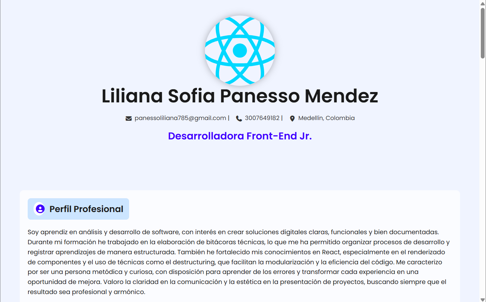
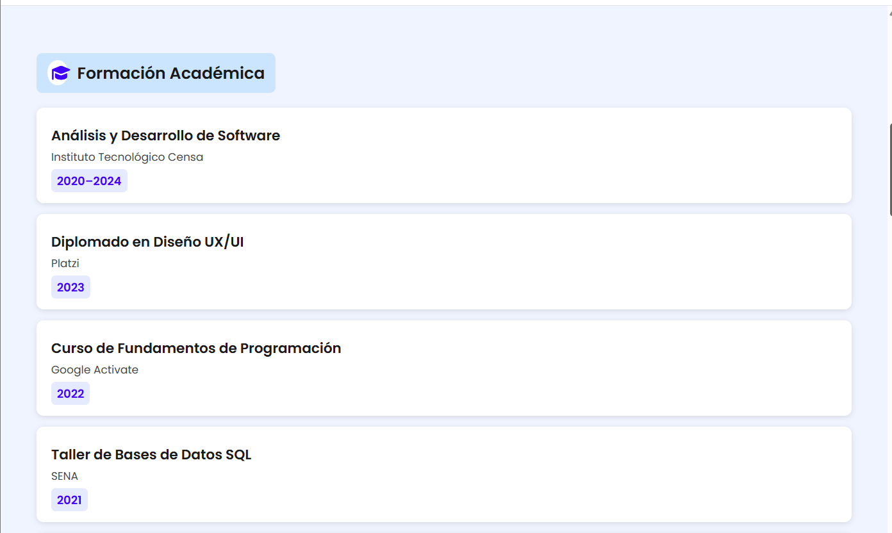
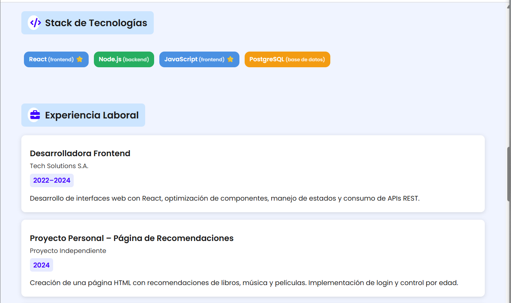

Liliana Panesso — Aprendiz SENA Proyecto: GA1-220501096-03-AA1-EV05

Mi Proyecto: Hoja de Vida en React

Este es un proyecto que desarrollé en React, donde muestro mi hoja de vida digital de una forma organizada y visualmente clara.
Decidí separar cada parte del CV en componentes (Cabecera, Perfil, Educación y Experiencia) para trabajar el código de manera más ordenada y entender mejor cómo funciona la estructura de una aplicación en React.

Vista previa en el navegador

Cómo ejecutar el proyecto

1. Clonar el repositorio:https://github.com/PROYECTOWEBREACT2/PROYECTO_REACT.git
2. Instalar dependencias, Dentro de la carpeta del proyecto ejecuto: npm install
3. Iniciar la aplicación, Para ver el proyecto en el navegador uso:npm run dev
4. Luego ingreso a:http://localhost:5173/

Mi CV en React – Renderizado Condicional y Listas
Actividad: GA1-220501096-03-AA1-EV06

 Descripción del proyecto

 Este proyecto lo realicé como parte de la actividad GA1-220501096-03-AA1-EV06, donde tenía que construir una hoja de vida dinámica usando React.
El objetivo principal era practicar renderizado condicional y renderizado de listas, para que el contenido se mostrara dependiendo de los datos y de algunas condiciones lógicas dentro del código.

Componentes que construí
1. Experiencia.jsx

Aquí hice un arreglo con 10 experiencias, entre proyectos y trabajos (reales y de práctica).
Cada objeto tiene:

cargo

empresa

año

una descripción corta

Commit realizado:
feat: componente Experiencia dinamico con 10 cargos definidos

2. Educacion.jsx

En este componente añadí mis estudios, cursos y formaciones.
Cada entrada contiene:

institución

nombre del curso

año

Commit realizado:
feat: componente Educacion dinamico con formación complementaria

3. StackTecnologias.jsx

Este componente fue el más visual.
Rendericé una lista de tecnologías y, dependiendo del tipo (frontend, backend o base de datos), se pinta de un color diferente.
Esto lo hice usando renderizado condicional y la función map().

Commit realizado:
feat: componente StackTecnologias dinamico y con renderizado condicional.

Requisitos para ejecutar el proyecto

Para correr este proyecto utilicé:

Visual Studio Code

Node.js (versión LTS)

React con Vite

Git y GitHub

Un navegador actualizado

Cómo ejecutar el proyecto

1. Clonar el repositorio:https://github.com/PROYECTOWEBREACT2/PROYECTO_REACT.git
2. Instalar dependencias, Dentro de la carpeta del proyecto ejecuto: npm install
4. Entrar al proyecto: PROYECTO_REACT
3. Iniciar la aplicación, Para ver el proyecto en el navegador uso:npm run dev
4. Luego ingreso a:http://localhost:5173/

Captura del resultado

