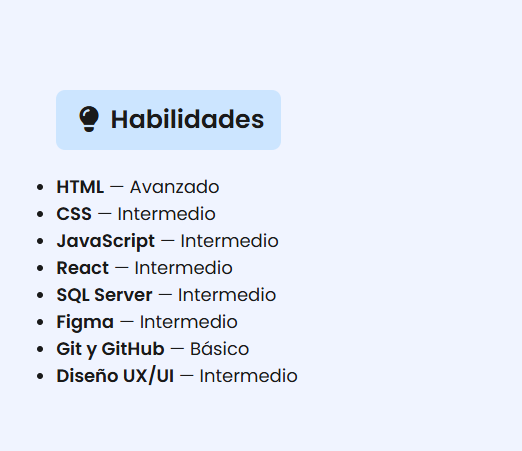

Liliana Panesso — Aprendiz SENA Proyecto: GA1-220501096-03-AA1-EV05

Mi Proyecto: Hoja de Vida en React

Este es un proyecto que desarrollé en React, donde muestro mi hoja de vida digital de una forma organizada y visualmente clara.
Decidí separar cada parte del CV en componentes (Cabecera, Perfil, Educación y Experiencia) para trabajar el código de manera más ordenada y entender mejor cómo funciona la estructura de una aplicación en React.

Vista previa en el navegador

Cómo ejecutar el proyecto

1. Clonar el repositorio:https://github.com/PROYECTOWEBREACT2/PROYECTO_REACT.git
2. Instalar dependencias, Dentro de la carpeta del proyecto ejecuto: npm install
3. Iniciar la aplicación, Para ver el proyecto en el navegador uso:npm run dev
4. Luego ingreso a:http://localhost:5173/

Mi CV en React – Renderizado Condicional y Listas
Actividad: GA1-220501096-03-AA1-EV06

 Descripción del proyecto

 Este proyecto lo realicé como parte de la actividad GA1-220501096-03-AA1-EV06, donde tenía que construir una hoja de vida dinámica usando React.
El objetivo principal era practicar renderizado condicional y renderizado de listas, para que el contenido se mostrara dependiendo de los datos y de algunas condiciones lógicas dentro del código.

Componentes que construí
1. Experiencia.jsx

Aquí hice un arreglo con 10 experiencias, entre proyectos y trabajos (reales y de práctica).
Cada objeto tiene:

cargo

empresa

año

una descripción corta

Commit realizado:
feat: componente Experiencia dinamico con 10 cargos definidos

2. Educacion.jsx

En este componente añadí mis estudios, cursos y formaciones.
Cada entrada contiene:

institución

nombre del curso

año

Commit realizado:
feat: componente Educacion dinamico con formación complementaria

3. StackTecnologias.jsx

Este componente fue el más visual.
Rendericé una lista de tecnologías y, dependiendo del tipo (frontend, backend o base de datos), se pinta de un color diferente.
Esto lo hice usando renderizado condicional y la función map().

Commit realizado:
feat: componente StackTecnologias dinamico y con renderizado condicional.

Requisitos para ejecutar el proyecto

Para correr este proyecto utilicé:

Visual Studio Code

Node.js (versión LTS)

React con Vite

Git y GitHub

Un navegador actualizado

Cómo ejecutar el proyecto

1. Clonar el repositorio:https://github.com/PROYECTOWEBREACT2/PROYECTO_REACT.git
2. Instalar dependencias, Dentro de la carpeta del proyecto ejecuto: npm install
4. Entrar al proyecto: PROYECTO_REACT
3. Iniciar la aplicación, Para ver el proyecto en el navegador uso:npm run dev
4. Luego ingreso a:http://localhost:5173/

Captura del resultado

 Reutilización de componentes en React – Props y desestructuración con una hoja de vida dinámica
Actividad: GA1-220501096-03-AA1-EV07 

Explicación de la Actividad

En este proyecto, cada uno de mis componentes recibe información desde App.jsx a través de props.
Los props funcionan como datos que viajan del componente padre hacia los componentes hijos, permitiendo que cada sección del CV se renderice de manera dinámica.

A continuación explico, en palabras, cómo utilicé cada prop en mis componentes:

 1. Componente CabeceraCV

Este componente recibe tres props principales:

nombre

Este prop contiene el nombre de la persona.
Lo usé para mostrarlo como el título principal de la cabecera del CV.

rol

Este prop representa el cargo o rol profesional.
Lo utilicé para colocarlo debajo del nombre, destacando la profesión o área laboral.

contacto

Este prop es una lista de elementos de contacto.
Dentro del componente, hice un recorrido de cada elemento y lo imprimí como parte de una línea de información, colocando íconos y texto del contacto.
En resumen, este prop permitió mostrar los diferentes medios de contacto de forma dinámica.

2. Componente Educacion

Este componente recibe un prop llamado:

educacion

Este prop es una lista de estudios realizados.
Cada elemento de la lista contiene el curso, la institución y el año.
Dentro del componente lo utilicé para recorrer y mostrar cada formación académica como un bloque independiente.
Gracias a este prop el componente puede mostrar una cantidad variable de estudios sin necesidad de escribirlos manualmente.

 3. Componente Experiencia

Este componente recibe el prop:

experiencias

Este prop es una lista de empleos o trabajos realizados.
Cada experiencia incluye cargo, empresa, año y descripción.
Dentro del componente se recorre la lista y se muestra la información de cada empleo.
El prop permite que el contenido se adapte automáticamente a las experiencias que se envíen desde el componente principal.

4. Componente Habilidades

Este componente recibe el prop:

habilidades

Este prop es una lista donde cada elemento indica una habilidad y su nivel (por ejemplo: básico, intermedio o avanzado).
Lo utilicé para mostrar cada habilidad dentro de una lista visual.
El componente no inventa nada, simplemente muestra lo que recibe a través del prop.

5. Componente Perfil

Este componente recibe un solo prop:

texto

Este prop contiene la descripción profesional o resumen del perfil.
Lo usé para mostrar un párrafo que representa la presentación del perfil laboral, permitiendo cambiar este texto fácilmente desde el componente padre sin modificar el componente.

6. Componente Proyectos

Este componente recibe el prop:

proyectos

Este prop es una lista de proyectos desarrollados.
Cada proyecto trae información como el título, el año, la descripción y las tecnologías utilizadas.
Dentro del componente, utilizo este prop para mostrar cada proyecto en su propio bloque, junto con sus etiquetas de tecnologías.

7. Componente StackTecnologias

Este componente recibe el prop:

tecnologias

Este prop es una lista con diferentes tecnologías, cada una indicando su nombre y el tipo (por ejemplo, frontend, backend o base de datos).
Dentro del componente, este prop permite clasificar visualmente cada tecnología según su tipo, y mostrarla como una etiqueta de color.
Esto hace que el componente sea totalmente dinámico según la cantidad y tipo de tecnologías que reciba.

Resultado en Navegador

